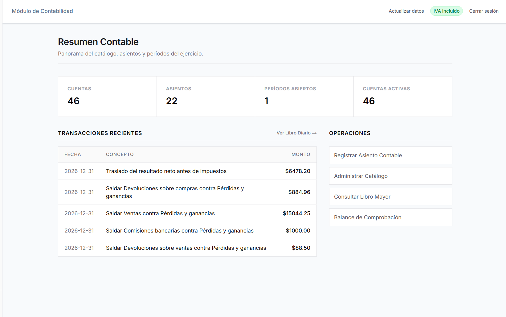

# Sistema Contable

Aplicación web en español para administrar ejercicios contables, registrar operaciones por partida doble y consultar estados financieros. Reúne el catálogo de cuentas, el diario, el mayor, el control de inventarios y el cierre del ejercicio en un mismo lugar.

Cada usuario dispone de sus propios ejercicios, con acceso desde distintos equipos y opciones para descargar respaldos, restaurarlos y consultar períodos anteriores.

## Vista previa

> **Captura pendiente:** toma una captura de la pantalla **Resumen Contable**, con el menú lateral y datos de ejemplo. Guárdala en `docs/images/resumen-contable.png` (crea la carpeta si no existe). Usa una imagen horizontal de aproximadamente 1440 × 900 píxeles y oculta correos o datos personales. Después sustituye este aviso y el bloque de ejemplo por la siguiente línea Markdown, sin las comillas invertidas:

```markdown

```

## Funcionalidades

| Módulo | Funciones |
|---|---|
| Resumen | Consulta de cuentas, períodos abiertos y movimientos recientes. |
| Catálogo | Cuentas jerárquicas, subcuentas, activación e importación y exportación JSON. |
| Libro Diario | Registro de asientos balanceados, cálculo de IVA, ajustes y reversiones. |
| Libro Mayor | Consolidación de movimientos por cuenta de mayor. |
| Balanza de comprobación | Comparación de movimientos y saldos deudores y acreedores. |
| Kardex | Control de existencias, costos y movimientos vinculados al diario. |
| Liquidación de IVA | Consulta y registro de la liquidación de crédito y débito fiscal. |
| Estados financieros | Estado de resultados, balance y cierre de resultados. |
| Configuración | Períodos, reglas de IVA e inventario, respaldos y ejercicios archivados. |
| Mi cuenta | Perfil, contraseña y recuperación de acceso. |

## Flujo de trabajo

1. Crea una cuenta e inicia sesión.
2. Revisa el catálogo y abre el período del ejercicio.
3. Define el tratamiento del IVA y las cuentas para inventarios e informes.
4. Registra o importa los asientos en el Libro Diario.
5. Comprueba los movimientos en el Mayor y la balanza.
6. Completa el Kardex o el inventario físico, consulta los informes y registra los ajustes y cierres que correspondan.
7. Descarga un respaldo o archiva el ejercicio para continuar con otro.

Los asientos deben cuadrar antes de guardarse. Las reversiones conservan las operaciones originales para consulta y los períodos bloqueados impiden registrar nuevos movimientos. Si dos sesiones intentan guardar sobre una misma versión del ejercicio, el sistema solicita actualizar los datos antes de continuar.

## Instalación

Necesitas Node.js compatible con las dependencias del proyecto, npm y un servicio de base de datos y autenticación configurado. La [guía de instalación](supabase/README.md) explica cómo crear el proyecto, ejecutar los scripts y configurar las credenciales.

Desde la carpeta del repositorio:

```bash
npm ci
```

Copia `.env.example` como `.env.local` y completa los valores según la guía. En PowerShell:

```powershell
Copy-Item .env.example .env.local
```

Si ya tienes las variables configuradas en `.env` o `.env.local`, conserva ese archivo y revisa los valores; no lo reemplaces por la plantilla.

```bash
npm run dev
```

Abre `http://localhost:3000`. Los archivos con credenciales se mantienen fuera del repositorio.

## Base de datos y catálogo

La instalación incluye una plantilla de **43 cuentas**: 20 grupos y rubros, y 23 cuentas operativas correspondientes a la guía de ejemplo. Los asientos de ejemplo se importan por separado.

| Archivo | Propósito |
|---|---|
| [schema.sql](supabase/schema.sql) | Tablas, relaciones, índices, validaciones y permisos. |
| [data.sql](supabase/data.sql) | Catálogo inicial de cuentas. |
| [diagram.sql](supabase/diagram.sql) | Estructura para importar en una herramienta de diagramación. |
| [diagram.dbml](supabase/diagram.dbml) | DER para dbdiagram.io. |
| [diagram.drawio](supabase/diagram.drawio) | DER editable en diagrams.net / draw.io. |

Consulta las [notas del catálogo](supabase/CATALOGO.md) antes de importar otra numeración. Los archivos del DER son para documentación; la instalación utiliza `schema.sql` y `data.sql`.

## Documentación

- [Instalación, configuración y recuperación de datos](supabase/README.md).
- [Uso del catálogo, registro de asientos y cálculo de IVA](docs/uso.md).
- [Correspondencia de cuentas y archivos de ejemplo](supabase/CATALOGO.md).
- [Asientos de la guía personalizada](examples/asientos-guia1-personalizado.json).

## Desarrollo y verificación

```bash
npm test
npm run typecheck
npm run lint
npm run build
```

Las pruebas cubren las reglas contables, la persistencia, el aislamiento entre usuarios y la restauración de ejercicios. La suite de base de datos se ejecuta en PostgreSQL embebido y no modifica la base de datos configurada en tu entorno.

Para ejecutar la compilación de producción localmente, utiliza `npm start` después de `npm run build`. El alojamiento debe ejecutar la aplicación y su API; una exportación de archivos estáticos no cubre el guardado de operaciones.

## Preparar la entrega

Desde PowerShell, en la carpeta del proyecto:

```powershell
.\scripts\package-delivery.ps1
```

El ZIP se guarda en `entrega/` e incluye el código actual, los SQL, la documentación y un resumen del historial Git. Excluye dependencias, compilaciones y archivos de credenciales. Después de extraerlo, instala las dependencias con `npm ci` y sigue la guía de instalación. El video y el manual en PDF se adjuntan por separado si los exige la actividad.

## Alcance actual

El sistema trabaja con ejercicios individuales por usuario y requiere conexión para guardar cambios. Incluye inventario analítico con o sin traslados a Compras. Los accesos compartidos con roles y el inventario perpetuo no están implementados.
